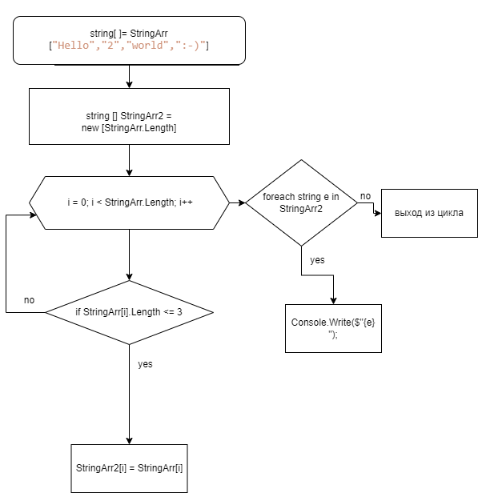

## Решение итоговой контрольной работы:

# Блок схема:

 

 # Текстовое описание решения 
  
 * Создаем функцию NewArr(),которая принимает исходный массив строк и возвращает новый массив строк с заданным условием.
 
 * Внутри функции NewArr() создаем пустой массив строк для нового массива по заданному условию.

 * 3 Запускаем цикл for и проверку условия на наличие до 3 символов включительно в каждом елементе исходного массива строк.

 * 4 Поочередно записываем по ходу цикла for те елементы исходного массива, которые соответствуют условию, в новый массив строк.

 * Функция NewArr() возвращает новый массив.

 * Для того чтобы увидеть новые елементы  массива строк, запускаем функцию вывода массива на консоль ShowArray() и передаем в качестве параметра новый массив строк.

